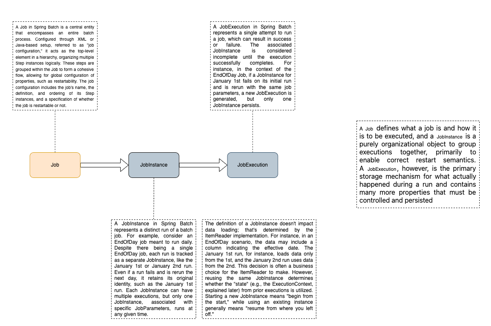

# Spring Batch demo for Parallel Programming Course 

Welcome to the Spring Batch demo! This project highlights an innovative approach to handling file imports through batch processing.
---

## 📚 Table of Contents

- [Overview](#overview)
- [Batch Jobs Explained](#batch-jobs-explained)
- [Steps Breakdown](#steps-breakdown)
- [Job Instances](#job-instances)
- [Job Executions](#job-executions)
- [Quick Start](#quick-start)

---

## Overview 🌟

Spring Batch is a powerful framework designed to simplify the development of scalable and resilient batch processing applications in Java. This repository demonstrates a method for importing files using batch jobs, emphasizing clarity and best practices.

---

## Batch Jobs Explained 🔄

A **Batch Job** is the backbone of the entire process. It encapsulates a series of operations, enabling smooth coordination among different tasks. Jobs can be configured using XML or Java, offering flexibility and control over restart policies and error management.

---

## Steps Breakdown 📊

A **Step** represents a single phase in a batch job. Each step performs a specific task, such as reading data, transforming it, or writing the output. This modular design ensures that individual parts of the process can be managed and monitored independently.

---

## Job Instances 🗂️

A **Job Instance** corresponds to a unique execution of a batch job. For example, running the same file import job daily will create a new Job Instance each day. This helps in tracking and managing the history of job executions.

### Example:
- Daily file import recorded as separate instances

---

## Job Executions 🏃‍♂️

A **Job Execution** captures the details of each attempt to run a Job Instance. Whether a job finishes successfully or encounters an error, each execution is logged separately, providing valuable insights for troubleshooting and auditing.

### Example:
- Initial execution of the daily job
- Retry after a failure, recorded as a distinct execution

---

## Quick Start ⚡

Ready to dive in? Here’s how to get started:

- **Set Up:** Configure your Spring Batch project environment.
- **Define Your Job:** Create and organize your batch job and its corresponding steps.
- **Implement Components:** Develop the necessary components for data reading, processing, and writing.
- **Configure Infrastructure:** Ensure your database and other infrastructure components are set up.
- **Execute & Monitor:** Launch your job and keep track of each Job Execution for performance insights.

---

## Learn More 🔍

For further details and comprehensive guides, please visit the [official Spring Batch documentation](https://docs.spring.io/spring-batch/docs/current/reference/html/index.html). Enjoy building robust batch processes and happy coding! 🎉